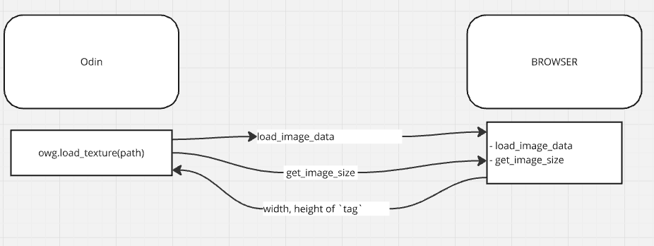

# Textures (from web noob)

Since we are working with the web, loading images isn't that trivial like loading a png with stb. To make it work I did some hackary arround HTMLImageElements and the `on_load` listener.

## Example code:

```odin
...

texture := owg.loadTexture(path)
...
```

## How it works:



`load_texture` is responsible for creating a `Texture` object with the properties we mostly care about:
    
- width, height, webgl.id
- tag

The `tag` is the actual generated id for the `` element that later is used to load the image data into webgl.

When `load_texture` is called:

### Odin-Side (WasmModule):
1. Call `WebGl.CreateTexture` to get the `webgl.id`
2. Call external `load_image_data` with the `path` of the image and the `webgl.id`

### Browser (load_image_data):
1. Create image element and add it to the browser with generated id of `"img_"+textureId` and display set to `none`
2. Load image data with `gl.texImage2D` and setting the generated image element `.src` with the provided `path`

### Odin-Side (WasmModule):
3. Add an event listener on image `load` using the provided odin module `vender:wasm/js`
4. Call external `get_image_size` with a pointer to `width` and `height` from the texture object when the added listener fires.

### Browser (get_image_size):
1. Read the image tag from the `wasm.memory`
2. Get element `width` and `height`
3. Set the wasm.memory at `width_ptr` and `heigth_ptr` with the element values

## Hmmm:

I don't know if this is the right aproach for the problem but since we don't have access to a png loader on the odin side without implementing the same functions on the browser side, this seems a easy and workable solution.